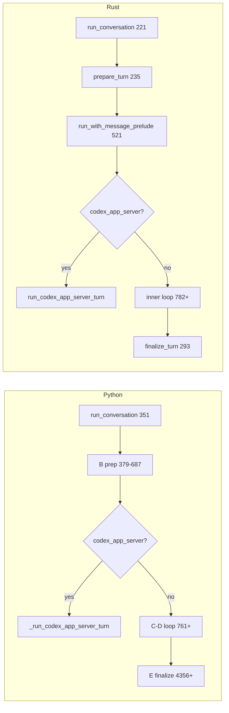

# `run_conversation` Parity: Python ↔ Rust

**Goal:** 100% behavioral parity between Python `agent.conversation_loop.run_conversation` and Rust `hermes-agent` conversation turn API. Where Rust is strictly better (typed results, cache safety, telemetry), document Rust as canonical.

**Last refreshed:** 2026-05-19 (8 priority gaps closed: retry matrix subset, session persist, `completed`, infra hooks, write-origin, Codex approval callback, module split, `WebResearchController` wiring).

**Python source:** `hermes-agent/agent/conversation_loop.py` (`run_conversation` @ L351).  
**Rust source:** `crates/hermes-agent/src/conversation_loop.rs` + `chat_completion_helpers.rs`, `tool_executor.rs`, `retry_failover.rs`, `turn_finalize_hooks.rs`, `skill_provenance.rs`, `codex_runtime.rs`, `web_research.rs`, `nous_rate_guard.rs`, `message_sanitization.rs`.

## Architecture mapping

Python keeps almost everything inside one function (`run_conversation`, ~4.6k lines). Rust splits the same responsibilities:

| Segment | Python | Rust |
|---------|--------|------|
| **Product entry** | `conversation_loop.py:351` `run_conversation` | `conversation_loop.rs:221` `AgentLoop::run_conversation` |
| **Thin forwarder** | `run_agent.py` `AIAgent.run_conversation` | CLI/gateway call `AgentLoop::run_conversation` directly |
| **B — turn prep** | inline `379–687` | `conversation_loop.rs:235` `prepare_turn` + `agent_loop.rs` `apply_turn_message_prelude` |
| **C–D — tool loop** | inline `688–4354` (+ codex bypass `747–759`) | `conversation_loop.rs:521` `run_with_message_prelude` |
| **E — turn finalize** | inline `4356–4607` | `conversation_loop.rs:293` `finalize_turn` + `agent_loop.rs` `finalize_agent_result` |
| **LLM HTTP + retry** | `agent/chat_completion_helpers.py` | `chat_completion_helpers.rs` `call_llm_with_retry*` + `retry_failover.rs` |
| **Tool dispatch** | `run_agent.handle_function_call` | `tool_executor.rs` `execute_tool_calls` |
| **Codex app-server turn** | `747–759` → `_run_codex_app_server_turn` | `conversation_loop.rs:676–686` → `codex_runtime.rs:34` `run_codex_app_server_turn` |

### Split modules (parity stubs)

| File | Role |
|------|------|
| `chat_completion_helpers.rs` | `call_llm_with_retry` / `call_llm_with_retry_inner` (was inline in `agent_loop.rs`) |
| `tool_executor.rs` | `execute_tool_calls` batch dispatch |
| `retry_failover.rs` | `FailoverReason` + billing / thinking-signature classifiers used by retry loop |
| `turn_finalize_hooks.rs` | E-segment infra: scaffolding drop, trajectory, task cleanup, `set_runtime_main` |
| `skill_provenance.rs` | Thread-local write-origin (`assistant_tool` / `background_review`) |

## Entry points & types

| Item | Python | Rust | Status |
|------|--------|------|--------|
| Public API | `run_conversation(agent, …) -> dict` `351` | `run_conversation(params) -> ConversationResult` `221` | ✅ |
| Params | kwargs `351–358` | `RunConversationParams` `58–68` | ✅ (`system_message` via config / `stored_system_prompt`, not a param) |
| Loop result | flat dict `4507–4535` | `AgentResult` nested in `ConversationResult.loop_result` | ✅ (Rust typed; use accessors) |
| Engine wrappers | N/A (in-loop `_use_streaming`) | `run` / `run_stream` → `run_with_message_prelude` | ✅ |
| History helper | caller strips user line | `split_messages_for_run_conversation` `181` | ✅ |
| `final_response` | loop `4507–4508` | `extract_last_assistant_reply` + E-segment hooks `309–312` | ✅ |
| `last_reasoning` | loop `4498–4504` | `extract_last_reasoning_current_turn` `300` | ✅ |

## B segment — turn preparation

| Behavior | Python | Rust | Status |
|----------|--------|------|--------|
| Safe stdio install | `381` `_install_safe_stdio` | — (OS/CLI layer) | ⚠️ out of crate |
| Ensure DB session | `383` `_ensure_db_session` | lazy on first `persist_turn_session` | ⚠️ timing differs |
| `set_runtime_main` (auxiliary) | `390–397` | `apply_turn_prep_infrastructure_hooks` → `hermes_intelligence::runtime_main` `279` | ✅ |
| Session log context | `401` `set_session_context` | `session_log::set_session_context` + `tracing` span fields | ✅ |
| Skill write-origin ContextVar | `409` `set_current_write_origin` | `skill_provenance::set_current_write_origin("assistant_tool")` `280` | ✅ |
| Restore primary runtime | `414` `_restore_primary_runtime` | `apply_turn_message_prelude` → `restore_primary_runtime_at_turn_start` | ✅ |
| Sanitize user / persist override | `419–422` | `prepare_turn` `241–247` (+ surrogate comment `238–240`) | ✅ |
| Bind stream callback | `425` `agent._stream_callback` | `run_with_message_prelude` `on_chunk` arg | ✅ |
| `task_id` + `_current_task_id` | `429–434` | `prepare_turn` `253–260` | ✅ |
| Reset per-turn retry / guard state | `436–450` | reset inside `run_with_message_prelude` locals `728–766` | ✅ |
| `_vision_supported = True` | `455` | `vision_supported` + API rejection strip/retry in `chat_completion_helpers` | ✅ |
| Dead connection cleanup | `457–469` | `cleanup_dead_connections_at_turn_start` → `turn_start_connection_hygiene` | ✅ |
| Replay compression warning | `472–474` | `replay_compression_warning_at_turn_start` in `prepare_turn` | ✅ |
| `IterationBudget` new turn | `479` | `iteration_budget::IterationBudget` `752` | ✅ |
| Turn start log | `481–490` | `tracing::info!("conversation turn")` in `prepare_turn` + `ReplayRecorder` | ✅ |
| Copy history + append user | `493–562` | `prepare_turn` `272–273` + prelude in loop `584–586` | ✅ |
| Hydrate todo from history | `498–499` | `hydrate_todo_store` `621` | ✅ |
| Hydrate memory nudge counters | `510–520` | `hydrate_memory_nudge_counters_from_history` `332` | ✅ |
| User turn count++ | `529` | `EvolutionCounters.user_turn_count` hydrate + `prepare_turn` increment | ✅ |
| Reset stream/think scrubbers | `531–541` | `stream_scrubber` per iteration `769–771` | ✅ |
| `original_user_message` | `544` | `TurnFinalizeMeta` `249–251` | ✅ |
| Memory nudge arm | `549–556` | `649–660` | ✅ |
| System prompt cache / restore | `568–582` | `resolve_initial_system_prompt` / `active_cached_system_prompt` | ✅ |
| Preflight compression | `584–650` | `preflight_context_compress_with_status` `689–691` | ✅ |
| **`pre_llm_call` once before loop** | `652–686` | `apply_pre_llm_call_hooks_once` `674` | ✅ |
| Plugin context → **user** message | `657–684` | `inject_pre_llm_hook_into_user_message` | ✅ |

## C–D segment — main loop (`run_with_message_prelude`)

| Behavior | Python | Rust | Status |
|----------|--------|------|--------|
| **Codex app-server bypass** | `747–759` | `676–686` + `codex_runtime.rs` JSON-RPC session | ✅ (interactive approval when `codex_approval_callback` wired) |
| Interrupt handling | `766–771` | `InterruptController` `772–782` | ✅ |
| Memory `on_turn_start` | (in loop) | `memory_on_turn_start` `859` | ✅ |
| Memory prefetch (once) | `739–745` | `memory_prefetch` + `set_turn_ext_prefetch_cache` `663–672` | ✅ |
| Session `on_session_start` hook | in `_restore_or_build_system_prompt` | `OnSessionStart` when prompt not restored `606–614` | ✅ |
| ContextLattice / exploratory / objective hints | scattered | `622–635` | ✅ |
| Replay recorder | env-gated | `ReplayRecorder` `702–717` | ✅ |
| Max turns / iteration budget | `761` while + budget | `782–817`, `iteration_budget` | ✅ |
| Per-iter: skill iter counter | `818–820` (Python timing) | `836–847` | ✅ |
| Per-iter: checkpoint | in loop body | `822`, `checkpoint_mgr` | ✅ |
| Smart route + reliability guard | in loop | `868–905` region | ✅ |
| Turn governor / replay `turn_start` | in loop | governor windows `739–750`, replay records | ✅ |
| **`/steer` pre-API drain** | in API prep | `pending_steer.drain_pre_api_into_messages` in `prepare_ctx_for_api_call` | ✅ |
| **`_use_streaming` decision** | `1244–1273` | `use_streaming_llm_transport` + `ui_streaming` `529` | ✅ |
| Streaming API call | `_interruptible_streaming_api_call` | `collect_stream_llm_response` `995` | ✅ |
| Non-stream API call | `_interruptible_api_call` | `call_llm_with_retry` `1080` | ✅ |
| Stream-not-supported → disable session stream | chat_completion_helpers | `note_stream_not_supported` | ✅ |
| Copilot-ACP / acp URL → non-stream | `1254–1259` | `provider_blocks_llm_streaming` | ✅ |
| Empty / thinking inner retry | in response handling | inner loop `871–968` region | ✅ |
| Post-LLM hooks / transforms | in loop | `inject_hook_context` + `apply_transform_llm_output_hooks` `1174` | ✅ |
| **Ollama small context guard** | `_ollama_context_limit_error` `67–108` | `ollama_context_limit_error` `920` | ✅ |
| **Nous rate-limit guard (pre-call skip)** | `1123–1149` | `nous_rate_limit_remaining` in `chat_completion_helpers.rs` | ✅ |
| **Nous 429 record + genuine RL** | in retry matrix | `record_nous_rate_limit` / `is_genuine_nous_rate_limit` in `chat_completion_helpers.rs` | ✅ |
| **API retry matrix (core paths)** | `1122–~3200` | `chat_completion_helpers.rs` + `retry_failover.rs` | ⚠️ core paths wired; full classifier parity ongoing |
| Billing eager fallback | in retry loop | `FailoverReason::Billing` → credential pool + `try_activate_session_fallback` | ✅ |
| Auth OAuth refresh (one-shot) | provider-specific refresh flags | `refresh_oauth_store_tokens_if_needed` on `ErrorClass::Auth` | ⚠️ generic OAuth store only (no per-provider Codex/Nous refresh yet) |
| Thinking signature recovery | `2411–2429` | strip `reasoning_content` + cache invalidate, one-shot | ✅ |
| Cost guard degrade route | in loop | `resolve_cost_degrade_model` / `turn_route_cost_guard` | ✅ |
| Tool dedupe / repair / session_search hydrate | in loop | `deduplicate_tool_calls` / `repair_tool_call` / `hydrate_session_search_args` | ✅ |
| Parallel tool execution | `handle_function_call` | `tool_executor.rs` `execute_tool_calls` | ✅ |
| Tool guardrail halt | `3800–3805` | `tool_guardrails` + `guardrail_halt` exit | ✅ |
| Web tool budget | env / tool policy | `apply_web_tool_budget` when `web_research` disabled | ✅ |
| **`WebResearchController`** | — (Rust-only in Python tree) | planner/evaluator + `gate_web_batch` when `web_research.enabled` `768–779`, `1797+` | ✅ Rust extension wired |
| Stream mute / `stream_break` control chunks | `3750+` | `stream_mute` / `emit_stream_chunk` `515–577` | ✅ |
| Objective / finalizer retry guards | in loop | `objective_guard_*` / `finalizer_*` | ✅ |
| Continuation / truncated tool / codex ack | in loop | `continuation_retries`, `truncated_tool_call_retries`, `codex_ack_continuations` | ✅ |
| Budget pressure injection | in loop | `inject_budget_pressure_into_last_tool_result` | ✅ |
| Context pressure warn | in loop | `should_emit_context_pressure_warning` | ✅ |
| Auto-compress in loop | in loop | `auto_compress_if_over_threshold` | ✅ |
| Background review metrics emit | in loop | `emit_background_review_metrics` | ✅ |
| Max-iter summary + kanban failure | `4300–4354` | `handle_max_iterations` + kanban block tool result; DB `_record_task_failure` not ported | ⚠️ partial |
| **API message cache invalidate per inner turn** | implicit (rebuild each iter) | `invalidate_turn_api_messages_cache` `846` | ✅ Rust explicit + tested |
| **`pre_llm_call` per inner iteration** | **no** (once only `652–686`) | **no** (once only `674`) | ✅ |

### Turn-level API message cache (Rust design note)

Each inner loop iteration calls `invalidate_turn_api_messages_cache()` before LLM assembly (`846`). This is **conservative vs key-only caching**: in-place edits with unchanged `message_count` / `total_chars` can otherwise return stale `Arc<[Message]>`. Same-iteration LLM retries (empty response, 429) still hit cache when ctx is unchanged.

**Contract test:** `agent_loop::tests::turn_api_messages_cache_contract`.

### Retry matrix coverage (`retry_failover.rs` + `chat_completion_helpers.rs`)

| Python `FailoverReason` (subset) | Rust | Status |
|----------------------------------|------|--------|
| `billing` | `FailoverReason::Billing` → rate-limit path + eager fallback | ✅ |
| `rate_limit` / 429 | `ErrorClass::RateLimit` + credential pool + Nous guard | ✅ |
| `auth` | OAuth store refresh one-shot; then fail | ⚠️ partial vs per-provider refresh |
| `thinking_signature` | strip reasoning blocks, one-shot retry | ✅ |
| `context_overflow` | compress + retry | ✅ |
| vision shrink, encrypted replay, llama grammar, … | — | ❌ not yet |

## E segment — finalize & return

| Behavior | Python | Rust | Status |
|----------|--------|------|--------|
| **`completed` semantics** | `4357–4361` (`final_response` + under max iter + not failed) | `304–307` same predicate | ✅ |
| Trajectory save | `4363–4365` | `maybe_save_turn_trajectory` when `HERMES_SAVE_TRAJECTORIES=1` | ⚠️ env-gated (Python uses `save_trajectories` config) |
| Task VM/browser cleanup | `4367–4368` | `cleanup_task_resources` best-effort stub `316` | ⚠️ stub |
| Drop empty scaffolding | `4374` | `drop_trailing_empty_response_scaffolding` `316` | ✅ |
| Persist session | always `_persist_session` `4375` | always `persist_turn_session` `319` (no-ops without `session_id`) | ✅ |
| Turn-exit diagnostic log | `4377–4419` | `log_turn_exit_diagnostic` in `finalize_turn` | ✅ |
| File-mutation verifier footer | `4436–4444` | in-loop `file_mutation` tracker | ✅ |
| `transform_llm_output` hook | `4448–4468` | `apply_transform_llm_output_hooks` per LLM + E-segment `PostLlmCall` transforms | ⚠️ timing differs |
| `post_llm_call` on final text | `4475–4487` | `apply_turn_level_output_hooks` `309–312` | ✅ |
| `last_reasoning` boundary | `4498–4504` | `extract_last_reasoning_current_turn` `300` | ✅ |
| **`on_session_end` plugin (per turn)** | `4591–4605` | `turn_end_plugin_hooks` | ✅ (not memory shutdown) |
| Memory `on_session_end` at turn end | intentionally **not** called | same | ✅ |
| External memory sync | `_sync_external_memory_for_turn` `4565–4570` | `sync_external_memory_for_turn` in `finalize_turn` | ✅ |
| Background memory/skill review | `4572–4582` | `spawn_background_review` | ✅ |
| Skill nudge after loop | `4556–4562` | skill counter in loop; review at end | ✅ |
| `pending_steer` leftover | `4541–4543` | `finalize_agent_result` drains `pending_steer` | ✅ |
| Clear interrupt + stream callback | `4550–4554` | interrupt in `AgentLoop`; no global callback field | ✅ |
| Telemetry record | — | `hermes_telemetry::record_agent_turn` `323` | ✅ Rust extension |

## Return dict / `ConversationResult` fields

| Python key `4507–4535` | Rust | Status |
|------------------------|------|--------|
| `final_response` | `ConversationResult.final_response` | ✅ |
| `last_reasoning` | `ConversationResult.last_reasoning` | ✅ |
| `messages` | `loop_result.messages` / `messages()` accessor | ✅ |
| `api_calls` | `loop_result.api_calls` / accessor | ✅ |
| `completed` | `ConversationResult.completed` | ✅ |
| `turn_exit_reason` | `loop_result.turn_exit_reason` | ✅ |
| `failed` / `partial` / `interrupted` | accessors on `ConversationResult` | ✅ |
| `pending_steer` | `loop_result.pending_steer` | ✅ |
| `guardrail` | `loop_result.guardrail` / `guardrail()` | ✅ |
| `interrupt_message` | `loop_result.interrupt_message` | ✅ |
| `response_transformed` / `response_previewed` | `AgentResult` fields (`types.rs`) | ✅ (wire from hooks as implemented) |
| `model` / `provider` / `base_url` | `runtime_model()` / `runtime_provider()` / `runtime_base_url()` | ✅ |
| Token breakdown fields | `input_tokens`, `output_tokens`, cache/reasoning/prompt/completion/total on `AgentResult` | ✅ via `enrich_turn_telemetry` |
| `estimated_cost_usd` | `session_cost_usd()` | ✅ |
| `cost_status` / `cost_source` | accessors | ✅ |
| `session_id` | config / hook ctx | ⚠️ not duplicated on result struct |

## Rust extensions (not in Python `conversation_loop.py`)

| Feature | Rust location | Notes |
|---------|---------------|-------|
| **`WebResearchController`** | `web_research.rs`, wired in `run_with_message_prelude` | Adaptive planner/evaluator + per-message web budgets; **no Python counterpart in `conversation_loop.py`** |
| **`ConversationResult` + accessors** | `conversation_loop.rs:75–158` | Typed API vs flat dict — preferred for Rust callers |
| **Explicit API message cache invalidate** | `846` + unit test | Safer than key-only; see above |
| **`hermes-telemetry`** | `finalize_turn`, Nous/Codex counters | Observability only |
| **`retry_failover.rs`** | billing / thinking-signature classifiers | Subset of Python `error_classifier.py` |

## Related modules

| Python | Rust | Status |
|--------|------|--------|
| `agent/chat_completion_helpers.py` | `chat_completion_helpers.rs` + `retry_failover.rs` | ⚠️ core retry paths; full matrix audit ongoing |
| `run_agent.handle_function_call` | `tool_executor.rs` | ✅ split; behavior unchanged |
| `agent/iteration_budget.py` | `iteration_budget.rs` | ✅ |
| `agent/message_sanitization.py` | `message_sanitization.rs` | ✅ core paths |
| `agent/tool_guardrails.py` | `tool_guardrails.rs` | ✅ halt + block |
| `agent/nous_rate_guard.py` | `nous_rate_guard.rs` | ✅ |
| `agent/transports/codex_app_server*.py` | `transports/codex_app_server*.rs`, `codex_runtime.rs` | ✅ transport + `codex_approval_callback` |
| `agent/auxiliary_client.set_runtime_main` | `hermes-intelligence/src/runtime_main.rs` | ✅ |
| `tools/skill_provenance.py` | `skill_provenance.rs` | ✅ foreground default |
| `hermes_cli/plugins.py` | `plugins.rs`, `shell_hooks.rs` | ⚠️ hook payload parity fixtures ongoing |

## Tests (parity contracts)

| Area | Rust test location |
|------|-------------------|
| `run_conversation` task_id / steer | `tests/run_conversation_contracts.rs` |
| Stream callback | `run_conversation_contracts` / `run_agent_phase_a.rs` |
| Hooks / pre-api | `tests/run_conversation_hooks.rs` |
| `_use_streaming` gates | `agent_loop::tests::test_use_streaming_llm_transport_matches_python_gates` |
| API message cache contract | `agent_loop::tests::turn_api_messages_cache_contract` |
| Retry failover classifiers | `retry_failover.rs` unit tests |
| Message sanitization | `alignment_contracts.rs` fixtures |
| Nous rate guard | `nous_rate_guard.rs` unit tests |
| Web research controller | `web_research.rs` unit tests |

## Remaining gaps (lower priority)

1. ~~**Full `error_classifier.py` parity**~~ — core recovery paths in `error_classifier.rs` (image shrink, encrypted replay strip, llama.cpp grammar, oauth 1M beta, provider policy UX); full classifier matrix still partial.
2. ~~**Kanban budget-exhausted edge cases**~~ — `record_task_failure` + outcomes (`timed_out`, `spawn_failed`, …); dispatcher/task `failure_limit` tiers.
3. ~~**Trajectory save config**~~ — `AgentConfig.save_trajectories` + env `HERMES_SAVE_TRAJECTORIES` fallback.
4. ~~**Task VM/browser cleanup**~~ — `cleanup_task_resources` + `AgentBrowserBackend::release_task_session`.
5. ~~**Turn-prep dead-connection cleanup**~~ — done via `turn_start_connection_hygiene` (stale-client probe; not full socket scan).
6. ~~**Replay compression warning**~~ — `replay_compression_warning_at_turn_start` in `prepare_turn`.
7. ~~**Hook payload golden fixtures**~~ — `tests/fixtures/hook_payloads/*.json` + `plugins.rs` golden test.

## Line index quick reference

| Symbol | Python `conversation_loop.py` | Rust |
|--------|------------------------------|------|
| `run_conversation` | `:351` | `conversation_loop.rs:221` |
| Turn prep (B) | `:379–687` | `prepare_turn :235`, prelude `agent_loop.rs` |
| `set_runtime_main` | `:390–397` | `turn_finalize_hooks.rs` via `prepare_turn :279` |
| Write-origin ContextVar | `:409` | `skill_provenance.rs` via `prepare_turn :280` |
| Codex bypass | `:747–759` | `conversation_loop.rs:676–686` |
| Main loop (C–D) | `:761+` | `run_with_message_prelude :521` |
| `pre_llm_call` (once) | `:652–686` | `apply_pre_llm_call_hooks_once :674` |
| Cache invalidate / inner turn | (implicit) | `conversation_loop.rs:846` |
| Ollama context guard | `:67–108`, used in loop | `conversation_loop.rs:920` |
| Nous RL guard | `:1123–1149` | `chat_completion_helpers.rs` |
| LLM retry inner | (chat_completion_helpers) | `chat_completion_helpers.rs` |
| Tool dispatch | (handle_function_call) | `tool_executor.rs` |
| Web research gating | — | `conversation_loop.rs:768+`, `web_research.rs` |
| Finalize (E) | `:4356–4607` | `finalize_turn :293` |
| `_use_streaming` | `:1244–1273` | `agent_loop.rs` `use_streaming_llm_transport` |
| System prompt restore | `:218` `_restore_or_build_system_prompt` | `resolve_initial_system_prompt` |
| Return dict | `:4507–4535` | `ConversationResult` + `AgentResult` (`types.rs:290+`) |
