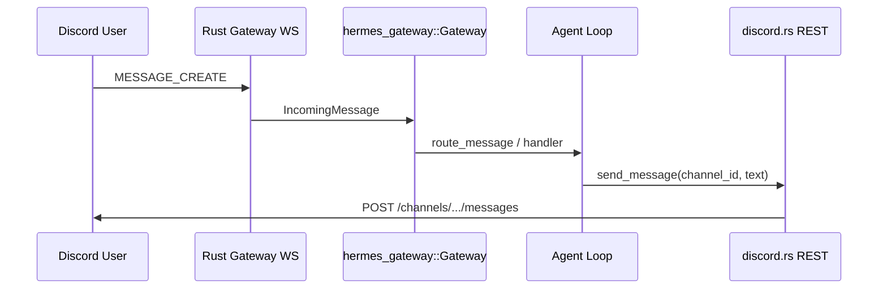

# Discord 渠道 Parity 路线图

> **上游基准**：[NousResearch/hermes-agent](https://github.com/NousResearch/hermes-agent) — `plugins/platforms/discord/adapter.py`（discord.py，约 6k+ 行）  
> **本仓 Rust**：[crates/hermes-gateway/src/platforms/discord/](../../crates/hermes-gateway/src/platforms/discord/)（`mod` + `session` / `gateway_loop` / `filter` / `parse` / `rest` / `dedup`）  
> **用户文档（描述 Python 行为）**：[website/docs/user-guide/messaging/discord.md](../../website/docs/user-guide/messaging/discord.md)

**最后更新**：2026-05-27  
**状态说明**：**P0 对话闭环已在 Rust 落地**（Gateway WS 入站 → 过滤/去重 → `Gateway::route_message` → REST 出站；CLI `run_gateway_incoming_loop` 已接线）。P1+ 能力仍见下文 backlog。

---

## 1. 优先级定义

| 级别 | 目标 | 用户可感知结果 |
|------|------|----------------|
| **P0** | **对话调通** | 启 `hermes gateway` 后，Discord DM / 频道里发文字 → Agent 处理 → 机器人回消息；基础鉴权与 @mention 规则可用 |
| **P1** | **日常可用** | 附件、slash 常用命令、反应/typing、线程与 free-response、配置项与 Python 对齐 |
| **P2** | **体验对齐** | 出站 reply 模式、allowed_mentions、文本批处理、频道 topic/skills、history backfill、Forum |
| **P3** | **高级能力** | Voice Mode、UI 组件（审批/Model Picker）、`discord_tool`、standalone cron 发送、command sync 全策略 |

**原则**：P0 完成前不扩散 scope；每完成一项在 [§5 功能对比表](#5-功能对比表) 更新状态列。

---

## 2. P0：对话调通（最小闭环）

### 2.1 P0 完成标准（验收）

在测试服务器或 DM 中满足：

1. `discord.enabled=true` 且 token 有效，`hermes gateway` 启动后机器人在线。
2. **DM**：授权用户发纯文本 → 收到 Agent 回复（可多轮）。
3. **Guild 文本频道**：`require_mention=true` 时，仅 @bot 触发回复；未 @ 不回复。
4. **未授权用户** 消息被静默丢弃（与 `DISCORD_ALLOWED_USERS` / config `allowed_users` 一致）。
5. Gateway 日志可见：`MESSAGE_CREATE` → `route_message` → 出站 `send_message` 成功。
6. 断线重连后不会对同一 `message.id` 重复回复（RESUME 去重）。

可选 P0.1（同迭代尽量带上）：`group_sessions_per_user` 在共享频道按用户隔离 session（Gateway 已有策略，需入站带上正确 `user_id` / `chat_id`）。

### 2.2 P0 任务分解（建议实现顺序）

| 序号 | 任务 | Rust 落点 | 上游参考 | 验证 |
|------|------|-----------|----------|------|
| P0-1 | Gateway WebSocket 连接（HELLO → IDENTIFY/RESUME → 心跳循环） | `discord/gateway_loop.rs` | `DiscordAdapter.connect()`、`on_ready` | ✅ `cargo test -p hermes-gateway --features discord` |
| P0-2 | `start()` / `stop()` 启动与优雅关闭 WS 任务 | `discord/mod.rs` `DiscordAdapter` | `connect` / `disconnect` | ✅ L-01/L-02 |
| P0-3 | `MESSAGE_CREATE` → `IncomingMessage` → `Gateway::route_message` | `parse.rs` + `gateway_loop` + CLI mpsc | `on_message` → `_handle_message` | ✅ G-02 + I-01..I-04 |
| P0-4 | 出站回复到正确 `channel_id` | `rest.rs` `send_message` | `send()` | ✅ 已有 |
| P0-5 | 忽略自身 bot 消息 | `filter.rs` | `on_message` L734–736 | ✅ F-01 |
| P0-6 | `allowed_users` / `DISCORD_ALLOWED_USERS` | Gateway `PlatformAccessPolicy` + `platform_requirements` fatal | `_is_allowed_user` | ✅ I-01/I-02 + `missing_allowed_users` |
| P0-7 | `require_mention`（guild 非 DM） | `filter.rs` + CLI 默认 `true` | `_discord_require_mention` | ✅ F-04/F-05 |
| P0-8 | RESUME 事件去重 | `dedup.rs` | `_dedup.is_duplicate` | ✅ D-01/D-02 + G-03 |
| P0-9 | `main.rs` 注册入站循环（对齐 weixin/dingtalk） | `main.rs` / `live_messaging.rs` | `gateway/run.py` 接线 | ✅ 已接线 |

**P0 明确不做**（推迟到 P1+）：附件下载、slash 注册与处理、Voice、反应、auto-thread、free-response 频道、角色鉴权、Forum、UI 组件、`discord_tool`。

### 2.3 P0 架构示意

**P0 已接**：WS → 过滤/去重 → mpsc → `run_gateway_incoming_loop` → `Gateway::route_message` → REST 出站。

---

## 3. P1–P3  backlog（对话调通之后）

### P1 — 日常可用

| ID | 功能 | 说明 |
|----|------|------|
| P1-1 | 入站附件（图/文/doc） | 下载并填入 `media_urls` / `media_types` |
| P1-2 | Opus 语音消息 | 转码/缓存后送 STT 管线 |
| P1-3 | Slash 基础集 | `/status` `/help` `/new` `/reset` `/stop` + defer 响应 |
| P1-4 | `application_id` + 命令注册 | 启动时 `register_slash_commands`（可先 guild 级） |
| P1-5 | `DISCORD_REACTIONS` | `on_processing_start/complete` → 👀/✅/❌ |
| P1-6 | Typing 指示器 | `send_typing` / `stop_typing` |
| P1-7 | `DISCORD_FREE_RESPONSE_CHANNELS` | 免 @ 频道 |
| P1-8 | `DISCORD_ALLOWED_CHANNELS` / `IGNORED_CHANNELS` | 频道白名单/黑名单 |
| P1-9 | `DISCORD_ALLOWED_ROLES` | 角色 OR 用户鉴权 |
| P1-10 | Auto-thread + `ThreadParticipationTracker` | 持久化线程参与集 |
| P1-11 | `PlatformAdapter::add_reaction` | trait 实现接 REST |

### P2 — 体验对齐

| ID | 功能 |
|----|------|
| P2-1 | `DISCORD_REPLY_TO_MODE`（off/first/all） |
| P2-2 | `allowed_mentions` / `DISCORD_ALLOW_MENTION_*` |
| P2-3 | 出站 `format_message` / `to_discord_markdown` 接入 send |
| P2-4 | 文本批处理 `HERMES_DISCORD_TEXT_BATCH_*` |
| P2-5 | `channel_prompts` / `channel_skills` |
| P2-6 | 频道 topic → session context |
| P2-7 | `DISCORD_HISTORY_BACKFILL` |
| P2-8 | Forum 发帖、`send_multiple_images`、video/animation/document |
| P2-9 | `DISCORD_ALLOW_BOTS`、多 bot @ 过滤（`IGNORE_NO_MENTION` 升级版） |
| P2-10 | `DISCORD_COMMAND_SYNC_POLICY` safe/bulk + 状态文件 |
| P2-11 | Slash 全量（model/personality/steer/compress/…） |
| P2-12 | Skill 分组 slash + autocomplete |

### P3 — 高级

| ID | 功能 |
|----|------|
| P3-1 | Voice Mode（join/leave/play/TTS/VoiceReceiver） |
| P3-2 | Interaction 按钮/Select（审批、clarify、model picker） |
| P3-3 | `tools/discord_tool` Rust 移植 |
| P3-4 | `_standalone_send` / cron 子进程发消息 |
| P3-5 | `DISCORD_PROXY` 全链路 |
| P3-6 | `interactive_setup` / 插件 `register(ctx)` |
| P3-7 | `dm_role_auth_guild` |
| P3-8 | `scripts/discord-voice-doctor.py` 等价诊断 |

---

## 4. 实现参考路径

| 区域 | 本仓 | 上游 |
|------|------|------|
| Adapter 核心 | [platforms/discord/](../../crates/hermes-gateway/src/platforms/discord/) | [adapter.py](https://github.com/NousResearch/hermes-agent/blob/main/plugins/platforms/discord/adapter.py) |
| CLI 注册 | [live_messaging.rs](../../crates/hermes-cli/src/live_messaging.rs)、[main.rs](../../crates/hermes-cli/src/main.rs) | `gateway/run.py` |
| Gateway 路由 | [gateway.rs](../../crates/hermes-gateway/src/gateway.rs) | `gateway/` Python 包 |
| 入站循环范例 | weixin / dingtalk / wecom 的 `set_inbound_sender` + `run_gateway_incoming_loop` | — |
| Markdown | [markdown_split.rs](../../crates/hermes-gateway/src/markdown_split.rs) `to_discord_markdown` | `format_message` |
| 配置 | [platform.rs](../../crates/hermes-config/src/platform.rs) | `config.yaml` + `DISCORD_*` env |
| Python 回归测试 | [tests/gateway/test_discord_*.py](../../tests/gateway/) | 移植为 Rust integration 或保留 Python 对照 |

**P0 已落地模块**：

- `gateway_loop.rs` — GET `/gateway`、WS 心跳、IDENTIFY/RESUME、DISPATCH
- `filter.rs` / `parse.rs` / `dedup.rs` — 入站 P0 规则与 `IncomingMessage` 构建
- 特征 flag：`discord`；依赖：`tokio-tungstenite`（workspace 已有）

---

## 5. 功能对比表

图例：**✅** 已有 · **🟡** 部分（API/解析有，未接入 Gateway 或未端到端）· **❌** 缺失 · **➖** 不适用/上游亦无

| 功能 | Python | Rust | 优先级 | 备注 |
|------|--------|------|--------|------|
| **P0：对话闭环** |
| Gateway WebSocket 连接 | ✅ discord.py | ✅ | P0 | `gateway_loop.rs` + `start()` |
| 入站 `MESSAGE_CREATE` → Gateway | ✅ | ✅ | P0 | CLI `run_gateway_incoming_loop` |
| 出站文本回复 | ✅ | ✅ | P0 | `rest.rs` `send_message` |
| 出站编辑 | ✅ | ✅ | P0 | 流式/状态消息可用 |
| 忽略 bot 自身消息 | ✅ | ✅ | P0 | `filter.rs` F-01/F-02 |
| `allowed_users` 鉴权 | ✅ | ✅ | P0 | Gateway policy + `missing_allowed_users` fatal |
| DM 授权响应 | ✅ | ✅ | P0 | `DmManager` + I-03/I-04 |
| Guild `require_mention` | ✅ | ✅ | P0 | 默认 `true`；`filter.rs` |
| RESUME 去重 | ✅ | ✅ | P0 | `dedup.rs` |
| `group_sessions_per_user` | ✅ | ✅ | P0 | `SessionManager::with_group_isolation`；I-05 |
| **P1：日常** |
| 入站图片/文件 | ✅ | ❌ | P1 | |
| 语音附件 Opus | ✅ | ❌ | P1 | |
| Slash `/status` 等 | ✅ | ❌ | P1 | Rust 仅有 register/respond 原语 |
| Slash defer + follow-up | ✅ | 🟡 | P1 | `defer_interaction` 有；无业务接线 |
| 处理中反应 👀✅❌ | ✅ | 🟡 | P1 | REST 有；trait 默认 no-op |
| Typing | ✅ | ❌ | P1 | |
| Free-response 频道 | ✅ | ❌ | P1 | |
| Allowed/ignored channels | ✅ | ❌ | P1 | |
| Allowed roles | ✅ | ❌ | P1 | |
| Auto-thread + 持久化 | ✅ | 🟡 | P1 | `create_thread` REST 有 |
| 系统消息过滤（type≠0/19） | ✅ | ✅ | P0 | `filter.rs` F-08；P1 扩展更多 type |
| **P2：体验** |
| Reply-to 模式 | ✅ | ❌ | P2 | |
| allowed_mentions 安全默认 | ✅ | ❌ | P2 | |
| 出站 Markdown 格式化 | ✅ | 🟡 | P2 | `to_discord_markdown` 未接入 send |
| 文本批处理 | ✅ | ❌ | P2 | |
| channel_prompts / skills | ✅ | ❌ | P2 | |
| 频道 topic 入 context | ✅ | ❌ | P2 | |
| History backfill | ✅ | ❌ | P2 | |
| Forum 发帖 | ✅ | ❌ | P2 | |
| 多图/视频/动图/文档出站 | ✅ | 🟡 | P2 | 部分仅 file/embed |
| `DISCORD_ALLOW_BOTS` | ✅ | ❌ | P2 | |
| Command sync safe/bulk | ✅ | ❌ | P2 | |
| Slash 全量 + skill 组 | ✅ | ❌ | P2 | |
| **P3：高级** |
| Voice join/leave/TTS | ✅ | ❌ | P3 | `voice.rs` 通用，未接 Discord VC |
| VoiceReceiver STT | ✅ | ❌ | P3 | |
| UI 按钮/Select 交互 | ✅ | 🟡 | P3 | `InteractionData` 解析有 |
| `discord_tool` | ✅ | ❌ | P3 | 仅 Python tests |
| Standalone send | ✅ | ❌ | P3 | cron 子进程 |
| `DISCORD_PROXY` | ✅ | 🟡 | P3 | `AdapterProxyConfig` 有字段 |
| DM role auth guild | ✅ | ❌ | P3 | |
| 插件 setup/register | ✅ | ➖ | P3 | Ultra 用 CLI config |

---

## 6. 配置 / 环境变量对照（实现时勾选）

P0 建议先支持：

| 配置 | env | P0 需要 |
|------|-----|---------|
| `platforms.discord.enabled` | — | ✅ |
| `token` | `DISCORD_BOT_TOKEN` | ✅ |
| `require_mention` | `DISCORD_REQUIRE_MENTION` | ✅ |
| `allowed_users` | `DISCORD_ALLOWED_USERS` | ✅ |
| `application_id` | — | ⬜ P1（slash） |
| `intents` | — | ✅ 至少 GUILDS \| GUILD_MESSAGES \| MESSAGE_CONTENT |
| `group_sessions_per_user` | — | ✅ 推荐 |

P1+ 再接入：`free_response_channels`、`ignored_channels`、`allowed_channels`、`reactions`、`auto_thread`、`reply_to_mode`、`allow_mentions.*` 等（见 [discord.md](../../website/docs/user-guide/messaging/discord.md)）。

---

## 7. 测试策略

| 阶段 | 做法 |
|------|------|
| P0 | `cargo test -p hermes-gateway --features discord`（模块单测 S/P/F/D/G + `tests/discord_p0_gateway.rs` + wiremock R-01/R-02）；手工 E2E 见下 |
| P1+ | 从 [tests/gateway/test_discord_*.py](../../tests/gateway/) 挑选用例，录 parity fixture 或 Rust 单测 |
| 回归 | `cargo test -p hermes-gateway`；禁止未测改 `expected` |

**P0 手工 E2E Checklist**（需真实 bot token，不纳入 CI）：

1. `~/.hermes/config.yaml`：`discord.enabled=true`，`token`，`allowed_users`（非空），`require_mention: true`
2. Developer Portal：启用 **Message Content** + **Server Members** intents
3. `cargo build -p hermes-cli --features discord` → `hermes gateway`
4. 日志出现 READY / Gateway 已连接
5. **DM**：授权用户发 `ping` → 有 Agent 回复
6. **Guild**：未 @bot → 无回复；@bot `ping` → 有回复
7. **未授权用户** → 无回复（guild 与 DM）
8. 重启 gateway，观察同一 `message.id` 不双响（dedup 日志）

---

## 8. 进度跟踪

| 里程碑 | 目标日期 | 状态 |
|--------|----------|------|
| M0 文档 | 2026-05-27 | ✅ 本文档 |
| M1 P0 WS + 入站 | 2026-05-27 | ✅ `gateway_loop` + CLI mpsc |
| M2 P0 鉴权 + mention | 2026-05-27 | ✅ filter + `platform_requirements` |
| M3 P0 Rust 测试 + 手工 E2E | 2026-05-27 | ✅ 自动化测试；E2E 待人工 checklist |
| M4 P1 附件 + slash 基础 | TBD | ⬜ |

---

## 9. 相关文档

- [Adapter Feature Matrix](./adapter-feature-matrix.md) — 平台清单（discord 标 rust-native 的语义见 § 文首）
- [PARITY_PLAN.md](../../PARITY_PLAN.md) — 全局 8 周 parity 计划
- [AGENTS.md](../../AGENTS.md) — 移植 SOP（parity 任务分型）

---

## 修订记录

| 日期 | 说明 |
|------|------|
| 2026-05-27 | 初版：P0=对话调通，功能对比表与 P1–P3 backlog |
| 2026-05-27 | P0 实现完成：模块拆分、WS 闭环、测试套件、§5/§8 状态更新 |
