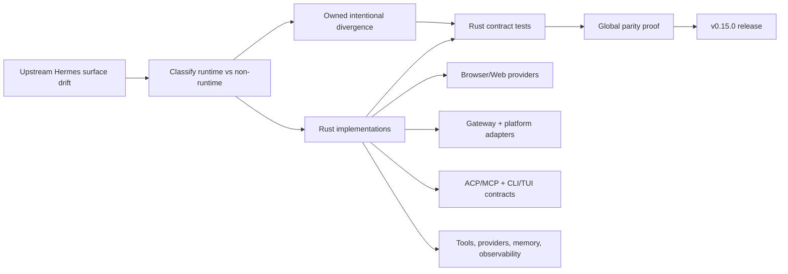

# Hermes Agent Ultra v0.15.0

Release date: 2026-06-03

This release is the parity-sprint release: `v0.14.2..v0.15.0` carries 199 first-parent commits and moves the current Rust workspace from broad parity backlog burn-down into release-gated, test-owned coverage. The headline is not one feature; it is the Rust runtime now owning the important upstream-compatible surfaces with explicit contracts instead of Python fallback behavior.

## Parity Sprint At A Glance



| Signal | v0.15.0 State |
| --- | --- |
| First-parent commits since `v0.14.2` | 199 |
| Shared-diff ledger rows owned | 1,052 |
| Shared-diff pending classification | 0 |
| Shared-diff pending review | 0 |
| Test intent mapping ratio | 1.0 |
| Global release gate | PASS |
| Global CI gate | PASS |
| Runtime language posture | Rust-first; release gate keeps Python runtime hot paths out |

## What Changed

- Browser and web provider parity moved into Rust, including Browser Use provider wiring, Browserbase/local CDP policy, keyless/free web providers, and local browser guardrails.
- Gateway parity advanced across session cache/control, blocking approvals, access control, delivery/channel directories, command surfaces, API server lifecycle, cron jobs, webhooks, HTTP pool limits, and platform-specific behavior.
- Discord, Telegram, Signal, WeCom/QQBot, webhook, and API-server surfaces gained Rust contracts for authorization, channel policy, media, reactions, rate limits, dynamic routes, and topic/session behavior.
- ACP/MCP surfaces gained Rust test ownership for auth methods, tool rendering/events, permission isolation/options, server wire behavior, resources/prompts, and handler contracts.
- Tools/runtime safety was hardened across terminal approvals, yolo scoping, command guards, schema sanitization, file/device safety, output limits, environment isolation, and tool-result persistence.
- Provider/runtime parity expanded across Anthropic, Bedrock, Tencent/TokenHub, API-key provider mapping, model normalization, provider profiles, OpenRouter/Nous routing, auxiliary clients, pricing, redaction, and compression continuity.
- CLI/TUI/source coverage was promoted into Rust parity contracts, including coverage manifests for former Python test-suite rows, TUI source rows, and CLI command/action rows.
- Observability and release-readiness improved with Langfuse/OTLP telemetry contracts, release security gates, SBOM workflow coverage, clippy warning gating, placeholder gates, and Rust no-Python runtime checks.
- Installer behavior is safer for real users: non-interactive `curl | bash` installs no longer hang in post-install probes, explicit `--setup` still runs bounded verification, and default installs preserve upstream NousResearch `hermes` while exposing `hermes-agent-ultra` and `hermes-ultra`.

## Install / Coexistence

Default install remains safe on machines that also have upstream NousResearch Hermes installed as `hermes`:

```bash
curl -fsSL https://raw.githubusercontent.com/sheawinkler/hermes-agent-ultra/main/scripts/install.sh | bash
hermes-ultra setup
```

By default, Ultra installs `hermes-agent-ultra` plus `hermes-ultra` and does not replace an existing `hermes` command. Users who explicitly want the legacy alias can still opt in with `INSTALL_LEGACY_ALIAS=1`.

## Verification Used For The Release Prep

```bash
bash -n scripts/install.sh
bash scripts/install.sh --help
cargo fmt --all --check
cargo test -p hermes-parity-tests --test installer_contract
cargo test -p hermes-parity-tests --test python_test_suite_coverage_contract
git diff --check
scripts/check-rust-runtime-no-python.sh
scripts/check-runtime-placeholders.sh
scripts/clippy-warning-gate.sh --check
cargo build --workspace
cargo test --workspace
```

Post-merge verification for the installer PR also passed `cargo build --workspace` and `cargo test --workspace` on `main` before release prep began.

## Release Asset Notes

The GitHub release workflow builds Linux, macOS, musl, and Windows artifacts, signs the archives with keyless Cosign, publishes the SBOM, and generates the checksummed Homebrew formula from the actual release artifacts. The static `packaging/homebrew/hermes-agent.rb` file in the repository may still point at the last published artifact set until the generated formula is attached to this release.
