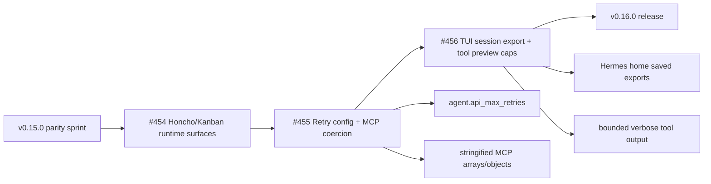

# Hermes Agent Ultra v0.16.0

Release date: 2026-06-05

This release picks up the post-`v0.15.0` parity closes on `main`: Honcho/Kanban runtime surfaces, configurable agent API retry behavior, MCP tool-argument coercion, and TUI/session export hardening. It is intentionally small relative to `v0.15.0`; the goal is to publish the newly merged Rust runtime parity work before the next backlog batch continues.

## Release Slice



| Signal | v0.16.0 State |
| --- | --- |
| First-parent commits since `v0.15.0` | 3 |
| Release coverage | PRs `#454`, `#455`, `#456` |
| Upstream queue total | 9,781 |
| Queue dispositions | 45 ported / 7,595 superseded / 162 mirrored / 1,979 pending |
| Runtime language posture | Rust-first; no Python runtime fallback added |
| Coexistence posture | Ultra aliases remain `hermes-agent-ultra` / `hermes-ultra` by default |
| Global release gate | PASS |

## What Changed

- Added Honcho/Kanban Rust runtime parity surfaces from the preceding merged batch.
- Added `agent.api_max_retries` configuration, including YAML alias support, environment override support, config-display coverage, and mapping into the Rust agent retry config.
- Added MCP tool argument coercion so stringified JSON arrays/objects are normalized before Rust MCP tool invocation.
- Reworked `hermes dump` into a real saved-session export under the Hermes home, preserving session metadata, model/personality fields, source path, system prompt, and message history.
- Bounded verbose TUI tool-output previews to avoid persisting or rendering pathological full-output trails.
- Preserved upstream coexistence: default installs expose Ultra as `hermes-agent-ultra` / `hermes-ultra` and do not clobber upstream NousResearch `hermes` unless users opt into the legacy alias.

## Verification

Post-merge parity verification for PRs `#455` and `#456` covered the runtime behavior:

```bash
cargo fmt --all --check
git diff --check
scripts/check-rust-runtime-no-python.sh
scripts/check-runtime-placeholders.sh
cargo test -p hermes-config agent_api_max_retries -- --nocapture
cargo test -p hermes-cli test_build_agent_config_maps_agent_api_max_retries -- --nocapture
cargo test -p hermes-mcp stringified_mcp_arguments -- --nocapture
cargo test -p hermes-mcp tools_call_coerces_stringified_object -- --nocapture
cargo test -p hermes-cli run_dump_writes_real_saved_session_export_with_system_prompt -- --nocapture
cargo test -p hermes-cli test_format_tool_message_lines_keeps_verbose_preview_small -- --nocapture
cargo build -p hermes-config -p hermes-cli -p hermes-mcp
cargo build -p hermes-cli
```

Release-prep verification for this tag covered the metadata bump, parity gates, release scan, and the fixture-only media test adjustment:

```bash
cargo metadata --format-version 1 --no-deps
python3 scripts/generate-global-parity-proof.py --repo-root . --check-ci --check-release
cargo fmt --all --check
git diff --check
scripts/check-rust-runtime-no-python.sh
scripts/check-runtime-placeholders.sh
python3 scripts/release_secret_scan.py --repo-root . --report .sync-reports/release-secret-scan-v0.16.0.json
cargo test -p hermes-gateway media_delivery_blocks -- --nocapture
```

The GitHub release workflow builds platform artifacts, signs release archives, attaches the SBOM, and publishes the generated release assets for tag `v0.16.0`.
