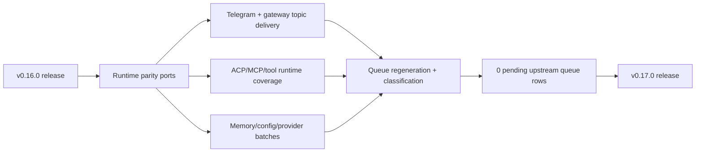

# Hermes Agent Ultra v0.17.0

Release date: 2026-06-09

This release publishes the post-`v0.16.0` parity sprint on `main`: the upstream missing queue is closed, all GPAR tickets are complete, and the Rust runtime now owns the added upstream-compatible behavior across ACP, MCP, tools, gateway adapters, Telegram, memory providers, model/provider config, skills, terminal, and RL training surfaces.

## Release Slice



| Signal | v0.17.0 State |
| --- | --- |
| First-parent commits since `v0.16.0` | 80 |
| Files changed since `v0.16.0` | 227 |
| Diff since `v0.16.0` | 64,449 insertions / 4,159 deletions |
| Upstream queue total | 5,375 |
| Queue dispositions | 238 ported / 5,067 superseded / 70 mirrored / 0 pending |
| Queue pending delta vs `v0.16.0` release note snapshot | 1,979 pending -> 0 pending |
| GPAR completion | GPAR-01 through GPAR-09 complete |
| Test intent mapping ratio | 1.0 |
| Global release gate | PASS |
| Global CI gate | PASS |
| Runtime language posture | Rust runtime; no Python runtime fallback added |

## Upstream Parity Gaps Closed

- Closed the upstream missing queue to zero pending commits. The tracked queue now records `238` ported commits, `5,067` superseded commits, and `70` mirrored commits.
- Ported the final pending upstream SSH/TUI behavior in Rust: SSH child processes detach stdin, and non-local terminal sessions preserve remote `TERMINAL_CWD` without validating it as a host path.
- Completed the Telegram topic/gateway tranche, including topic-aware delivery, cron integration, gateway command surfaces, and CLI preview behavior.
- Expanded ACP runtime parity: queue/steer runtime, public session metadata updates, structured tool results, usage mapping, provider metadata on model switch, available command advertisement, loaded-session replay, session info updates, streamed reasoning, image prompt forwarding, native todo plan updates, and tool rendering updates.
- Expanded MCP parity: runtime coverage hardening, sampling request handling, nullable argument preservation, live toolset alias resolution, and client MCP tool registration.
- Expanded tool runtime parity: MoA runtime and toolset aliases, provider-aware speech transcription, core tool contract coverage, disabled toolset enforcement, cron platform toolset handling, process notification deduplication, and terminal backlog closure.
- Expanded gateway and platform parity: media marker delivery, Discord voice mixer runtime, session-title persistence, session profile overlays, Ntfy explicit topic targets, and gateway-backed Telegram/topic command behavior.
- Expanded provider/config parity: direct Nous Portal API provider, versioned portal client tag, provider request timeouts, custom provider discovery flags, max token cap propagation, stale auxiliary pin warnings, Gemini request shaping, Kimi Code API endpoint support, Minimax M3 defaults, model preview expansion, and profile alias display.
- Expanded session and CLI/TUI parity: actual session usage display, portal onboarding default alias, saved-session resume search, session FTS optimization, runtime session WAL truncation, TUI history/queue surface coverage, TUI model provider environment sync, and TUI startup config hardening.
- Expanded agent and delegation parity: tool result name persistence, mid-turn steer marker trust, disabled toolset enforcement, provider-config subagent routing, and uncapped Rust spawn depth.
- Expanded RL/eval parity: training runtime tool registration, batch dataset runner, atomic batch checkpoints, and checkpoint persistence tests.
- Expanded memory provider parity: Hindsight runtime config and provider session behavior across Hindsight, Honcho, and OpenViking memory plugins.
- Expanded skills parity: installed command inventory refresh, installed slash-command routing, and upstream skills catalog sync.

## Ultra Differences Preserved

- Ultra remains Rust-runtime-first. Python remains acceptable for repo tooling and parity automation, but no Python runtime fallback was added in this release.
- ContextLattice remains an approved Ultra memory/plugin and automation difference. The release preserves the ContextLattice-first memory and summary-sink posture already documented in `README.md`, `docs/parity/parity-matrix.md`, and upstream-sync docs.
- Upstream Python-only or release-metadata commits are classified explicitly as `superseded` when the Rust runtime already owns the equivalent behavior or the Python surface does not apply to Ultra.
- Desktop/i18n/updater rows that do not map directly onto the Rust runtime are documented through parity classification rather than hidden as unresolved implementation work.
- Ultra keeps coexistence with upstream Hermes: default install aliases remain `hermes-agent-ultra` / `hermes-ultra` and do not intentionally clobber an upstream `hermes` command.

## Verification

Release-prep verification for this tag covered the metadata bump, parity gates, queue closure, runtime no-placeholder/no-Python checks, clippy warning gate, workspace build, workspace test, and release binary build:

```bash
CARGO_TARGET_DIR=/Volumes/wd_black/cargo-targets cargo metadata --format-version 1 --no-deps
python3 scripts/generate-global-parity-proof.py --repo-root . --check-ci --check-release --out-json /tmp/hermes-global-proof-check.json --out-md /tmp/hermes-global-proof-check.md
CARGO_TARGET_DIR=/Volumes/wd_black/cargo-targets cargo fmt --all --check
jq empty docs/parity/upstream-missing-queue.json docs/parity/global-parity-proof.json docs/parity/gpar-01-04-proof.json docs/parity/queue-overrides.json
git diff --check
scripts/check-rust-runtime-no-python.sh
scripts/check-runtime-placeholders.sh
python3 scripts/release_secret_scan.py --repo-root . --report .sync-reports/release-secret-scan-v0.17.0.json
scripts/clippy-warning-gate.sh --check
CARGO_TARGET_DIR=/Volumes/wd_black/cargo-targets cargo build --workspace
CARGO_TARGET_DIR=/Volumes/wd_black/cargo-targets cargo test --workspace --quiet
CARGO_TARGET_DIR=/Volumes/wd_black/cargo-targets cargo build --release -p hermes-cli
```

The GitHub release workflow can build and attach platform artifacts for tag `v0.17.0`. Local release gates are the authoritative release check for this cut.
