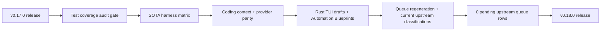

# Hermes Agent Ultra v0.18.0

Release date: 2026-06-11

This release publishes the post-`v0.17.0` parity and harness hardening slice on `main`: the upstream queue is closed again against `upstream/main` at `021ed6914162416522462b009de0bec1513c73a1`, the release and CI/tree-drift gates pass, and the Rust runtime now owns the newly applicable upstream coding, slash/provider, content replay, composer-draft, empty-session cleanup, Automation Blueprint behavior, and Automation Blueprints website terminology cleanup.

## Release Slice



| Signal | v0.18.0 State |
| --- | ---: |
| First-parent commits since `v0.17.0` after release refresh | 6 |
| Files changed since `v0.17.0` | 137 |
| Diff since `v0.17.0` | 27,412 insertions / 3,347 deletions |
| Upstream queue total | 5,593 |
| Queue dispositions | 266 ported / 5,257 superseded / 70 mirrored / 0 pending |
| Test coverage audit | PASS |
| Test coverage tracked behavior ratio | 1.0 |
| Test coverage missing Rust refs | 0 |
| SOTA harness matrix | PASS |
| SOTA harness domain coverage ratio | 1.0 |
| Global release gate | PASS |
| Global CI/tree-drift gate | PASS |
| Runtime language posture | Rust runtime; no Python runtime fallback added |

## Upstream Parity Gaps Closed

- Added a release-gated test coverage audit. The audit now tracks 415 behavior rows, covers all 415, validates 405 coverage-manifest entries, and reports 3,465 Rust test functions with 0 missing Rust test references.
- Added a release-gated SOTA harness matrix for workflow replay, protocol differential contracts, and fault-injection coverage. The matrix passes all 3 domains, covers 5 replay steps, 7 protocol cases, 6 fault scenarios, and all 7 required fault classes.
- Ported upstream coding-context posture into Rust with workspace detection, prompt-time coding guidance, model-family edit-format hints, ContextLattice-first memory posture, prompt-only non-coding skill pruning, and `agent.coding_context=focus` toolset collapse.
- Ported the functional slash/provider tranche: registry-driven slash command help/completions for the Rust CLI/TUI surfaces, Parallel-backed web search/extract, generic keyless Search MCP identity, and keyed Parallel REST payloads.
- Ported Anthropic ordered content replay by carrying in-memory `anthropic_content_blocks` and replaying signed thinking/tool-use blocks in order without adding a persisted state-db column.
- Ported upstream desktop composer-draft behavior into the Rust TUI with state-root backed per-session draft storage, startup restore, submit clearing, session-switch reload, and MRU-capped persistence that never writes unsent text to the conversation DB.
- Ported upstream empty-session hygiene into Rust. Session rotation and TUI shutdown now remove untitled, message-free, parentless session rows plus exact empty stub snapshots while preserving titled sessions, child sessions, message-bearing sessions, and non-empty snapshots.
- Ported upstream Cron Recipes under the final Automation Blueprints naming. The Rust `hermes-cron` catalog now owns typed slots, defaults, validation, quote-aware slash parsing, schedule rendering, and normal `CronJob` creation through the live `CronScheduler`; the Rust CLI/TUI exposes `/blueprint` and `/bp`.
- Ported the final upstream Automation Blueprints website terminology cleanup. The local website guide now lives at `guides/automation-blueprints`, the sidebar points at that slug, and the opening copy now uses the final Automation Blueprints product term.
- Closed the new upstream desktop stop-recovery delta as non-applicable to Rust. Rust TUI/ACP interrupts are in-process and keyed directly by active session id, with no desktop runtime-id versus stored-id split.
- Closed the new upstream compressed-lineage archive delta as non-applicable to Rust. Hermes Agent Ultra has no Rust session-archive column or Electron sidebar archive UI; `session_search` already projects compression roots forward to the visible continuation tip, and CLI session deletion remains saved-JSON snapshot deletion rather than SQLite soft archive.
- Closed the latest upstream passive update SSH-auth delta as non-applicable to Rust. Hermes Agent Ultra's `hermes update` path uses the GitHub HTTPS releases API and does not fetch `origin`, while the upstream Electron-only remote helper has no local desktop runtime equivalent.
- Closed the latest upstream desktop sidebar lineage-dedupe delta as already covered by Rust session search. The Rust backend resolves compression roots to their visible continuation tip and has focused regression coverage for that projection.
- Closed the latest upstream Electron filesystem, titlebar/sidebar, spellcheck, and model-visibility deltas as non-applicable to the Rust CLI/TUI runtime. Rust file access remains mediated by typed tools, terminal approval/workdir policy, and ACP/gateway session metadata rather than the upstream desktop file tree.
- Closed the latest upstream Discord `discord.py` zombie/reconnect-task deltas as non-applicable to Rust. The local Discord adapter has no Python `Bot.start` task; REST sends use `reqwest`, and the in-tree GatewaySession is a pure payload/session parser.

## Ultra Differences Preserved

- Ultra remains Rust-runtime-only. Python remains acceptable for repo tooling, parity generation, and release checks, but no Python runtime surface was introduced.
- ContextLattice remains the preferred Ultra memory backbone and orchestration helper. Coding-context guidance now makes that preference explicit for interactive coding surfaces.
- Upstream Python plugin/backend trees for `dashboard_auth/nous`, `image_gen/krea`, and `security-guidance` remain tracked as a temporary intentional divergence. They are still upstream-only and are scheduled for a dedicated plugin parity slice rather than silently vendored into the Rust runtime.
- Desktop React-only UI polish remains classified through parity evidence when there is no Rust desktop equivalent. Rust CLI/TUI/gateway behavior is the release-owned user surface.

## Verification

Release-prep verification for this tag covered version metadata, parity regeneration, queue closure, test coverage and SOTA harness gates, release proof, no-placeholder/no-Python runtime checks, clippy warning gate, workspace build, workspace test, and release binary build:

```bash
python3 scripts/generate-parity-matrix.py
python3 scripts/generate-workstream-status.py
python3 scripts/generate-test-intent-mapping.py
python3 scripts/generate-test-coverage-audit.py --check
python3 scripts/generate-adapter-matrix.py
python3 scripts/validate-intentional-divergence.py --check --allow-warnings
python3 scripts/generate-upstream-patch-queue.py --max-commits 0
python3 scripts/generate-global-parity-proof.py --repo-root . --check-ci --check-release
python3 scripts/generate-gpar-01-04-proof.py
python3 scripts/generate-parity-dashboard.py
python3 scripts/run-upstream-surface-coverage-gate.py --upstream-ref upstream/main --local-mode worktree
CARGO_TARGET_DIR=/Volumes/wd_black/cargo-targets cargo metadata --format-version 1 --no-deps
CARGO_TARGET_DIR=/Volumes/wd_black/cargo-targets cargo test -p hermes-agent delete_session_if_empty
CARGO_TARGET_DIR=/Volumes/wd_black/cargo-targets cargo test -p hermes-cli new_session
CARGO_TARGET_DIR=/Volumes/wd_black/cargo-targets cargo test -p hermes-cli discard_current_session_if_empty
CARGO_TARGET_DIR=/Volumes/wd_black/cargo-targets cargo test -p hermes-cron blueprints
CARGO_TARGET_DIR=/Volumes/wd_black/cargo-targets cargo test -p hermes-cli blueprint_slash_command_creates_cron_job
CARGO_TARGET_DIR=/Volumes/wd_black/cargo-targets cargo fmt --all --check
git diff --check
scripts/check-rust-runtime-no-python.sh
scripts/check-runtime-placeholders.sh
python3 scripts/release_secret_scan.py --repo-root . --report .sync-reports/release-secret-scan-v0.18.0.json
CARGO_TARGET_DIR=/Volumes/wd_black/cargo-targets scripts/clippy-warning-gate.sh --check
CARGO_TARGET_DIR=/Volumes/wd_black/cargo-targets cargo build --workspace
CARGO_INCREMENTAL=0 CARGO_TARGET_DIR=/Volumes/wd_black/cargo-targets cargo test --workspace --quiet -j 1
CARGO_TARGET_DIR=/Volumes/wd_black/cargo-targets cargo build --release -p hermes-cli
```

Hosted GitHub CI/CD is optional for this cut. Local release gates are the authoritative release check for tag `v0.18.0`.
